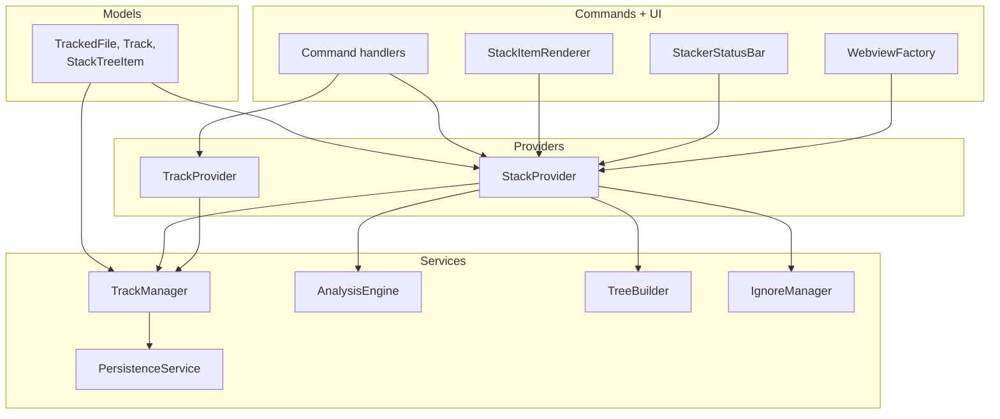
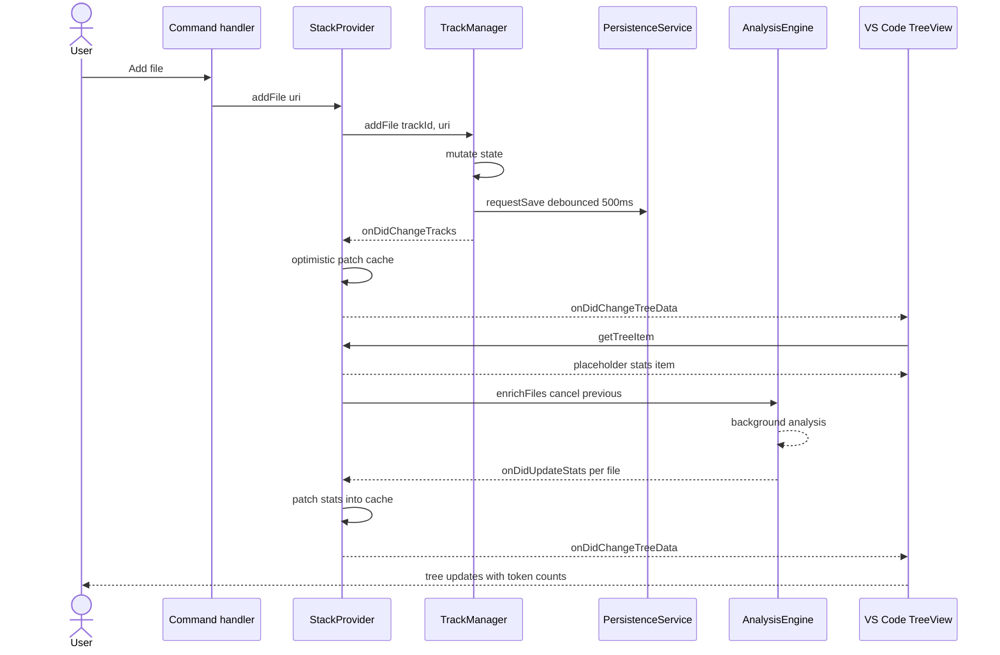

# Diagrams

Two diagrams covering Stackr's layered architecture and the event-driven flow when a user adds a file. Drawn from `.claude/ARCHITECTURE.md`, `.claude/REQUIREMENTS.md`, and the per-domain entries under `.claude/context/`.

## How the layers fit together

Layered components with the dependency direction `models → services → providers → commands + ui`. Each layer only depends on layers above it.

`TrackManager` is the single mutation owner. Every state change funnels through it, which is what makes the optimistic-patch decision in `StackProvider` safe. `PersistenceService` is the only service that touches `workspaceState`. Detail on each service lives in its matching `.claude/context/<domain>.md` entry.

## What happens when a user adds a file

The non-obvious part of this flow is the split between optimistic UI patching and background token analysis. The tree updates twice: once immediately with placeholder stats, once again per file as analysis completes.

The `requestSave` call returns immediately. The actual write happens on the 500ms debounce edge, gated by a fingerprint hash so identical state never writes twice. See `.claude/context/persistence.md` for the fingerprint rules and `.claude/context/stats-and-analysis.md` for the cancellation contract on `enrichFiles`.
