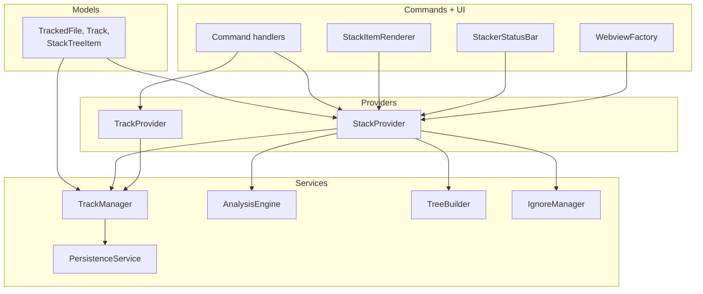

# Components

The diagram shows the dependency direction `models → services → providers → commands + ui`. Each layer depends only on the layers above it, so a change to a command handler cannot reach into a model without passing through a provider first.

`TrackManager` is the single mutation owner. Every state change funnels through it, which is what makes the optimistic-patch decision in `StackProvider` safe: the provider can trust that no other writer moved the state underneath its cache. `PersistenceService` is the only service that touches `workspaceState`, so storage concerns never leak upward. Open `src/providers/track-manager.ts` for the mutation surface and `src/services/persistence-service.ts` for the write path. Detail on each service lives in its matching `.claude/context/<domain>.md` entry.
