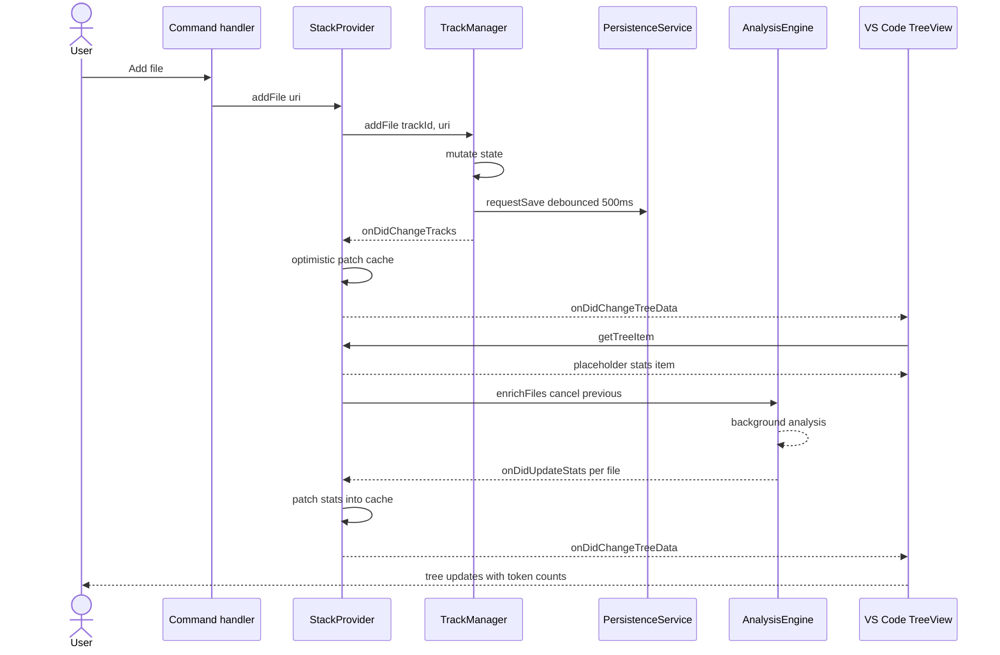

# Request flow

The diagram shows one add moving from a command handler to the tree view. The non-obvious part is the split between optimistic UI patching and background token analysis. The tree updates twice: once immediately with placeholder stats, then once again per file as analysis completes.

This shape was chosen so the tree never blocks on token counting, which is the slow step. The alternative, holding the first render until analysis finished, would have made every add feel as slow as the largest file in it. The `requestSave` call returns immediately, and the actual write happens on the 500ms debounce edge, gated by a fingerprint hash so identical state never writes twice. Open `src/providers/stack-provider.ts` for the patch decision and `src/services/persistence-service.ts` for the debounce and fingerprint. See `.claude/context/persistence.md` for the fingerprint rules and `.claude/context/stats-and-analysis.md` for the cancellation contract on `enrichFiles`.
