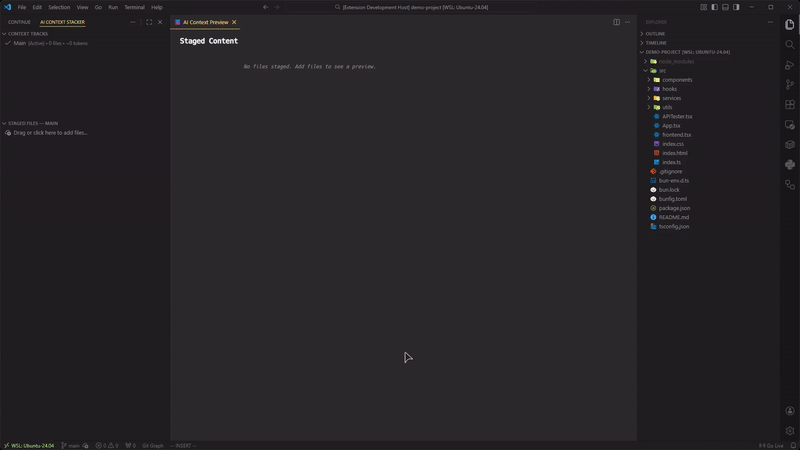

# AI Context Stacker

Stage files for LLM prompts without juggling tabs.

Build context for ChatGPT, Claude, Gemini, or any LLM directly from VS Code. Drag in files, organize them into tracks, and copy everything at once.

<p align="center">
  
</p>

## The Problem

When working with LLMs, you typically need to:

1. Open a file and copy its contents
2. Switch to your browser
3. Paste it into the chat
4. Return to VS Code
5. Repeat for each additional file

This gets tedious fast—especially with larger codebases or multi-file tasks.

## Quick Start

1. Install the extension from the VS Code Marketplace.
2. Open the **AI Context Stacker** view in the Activity Bar.
3. Drag files into the **Staged Files** panel.
   - Or right-click → **Add to AI Context Stack**.
4. Click **Copy Stack** or **Copy and Clear Stack**.
5. Paste into your LLM.

## Key Features

### File Staging

Drag files or folders into the staging area. Right-click any file in the Explorer to add it. The extension shows what’s staged and lets you copy everything in one go.

### Context Tracks

Create separate tracks for different tasks (e.g. _Bug Fix #123_, _Refactor Auth_). Each track maintains its own list of staged files.

- Reorder tracks by dragging or using **Alt + Up / Down**
- Rename tracks inline
- Quickly switch between tracks

Note: The extension always maintains at least one active track. The last remaining track cannot be deleted.

### Multi-root Workspace Support

Designed for professional workflows, AI Context Stacker fully supports **Multi-root Workspaces**.

Staged files are grouped by their project folder name so the LLM understands which project each file belongs to—even when multiple projects contain identical paths like `src/index.ts`.

Tip: In multi-root workspaces, both the context map and file headers automatically include the project folder name to prevent ambiguity for the LLM.

### Token Warnings

Files are color-coded based on estimated token count:

- **Amber** — over 5k tokens (configurable)
- **Red** — over 10k tokens
- **Pinned files** retain their pin icon while inheriting warning colors

This helps you spot large files before hitting model limits.

### Pinning and Filtering

- Pin files to protect them from **Clear Stack**
- Toggle **Show Pinned Files Only** to filter the view
- Copy commands respect the active filter

Pinned files persist across clears and workflow resets.

### Context Map

Optionally include an ASCII directory tree in the copied output to help the LLM understand your project structure. You can customize the header text or disable the map entirely in settings.

Optionally include an ASCII directory tree in the copied output to help the LLM understand project structure.

```

Context Map
├── components
│   ├── Header.tsx
│   ├── Sidebar.tsx
│   └── Footer.tsx
├── utils
│   ├── api.ts
│   └── helpers.ts
└── README.md

```

### Navigation

- Right-click files in the Explorer to add them or reveal them in the stack
- Right-click staged files to reveal them in your system file manager
- Quickly locate files without breaking flow

## Commands

### Stack Operations

| Command              | Description                                                               |
| :------------------- | :------------------------------------------------------------------------ |
| `Add Files...`       | Pick files to add to the stack (includes **Add All** option).             |
| `Add Folder...`      | Recursively scan and add an entire directory.                             |
| `Remove Files...`    | Bulk-remove selected files from the stack.                                |
| `Add All Open Files` | Stage all currently open text editors.                                    |
| `Add Current File`   | Stage the active editor.                                                  |
| `Reveal in AI Stack` | Locate the active file in the sidebar.                                    |
| `Clear Stack`        | Remove all **unpinned** files from the current track.                     |
| `Toggle Pin`         | Pin or unpin selected file(s) for bulk protection.                        |
| `Unpin All`          | Instantly unpin all files in the current track (found in the `...` menu). |

### Output & Clipboard

| Command                | Description                                                        |
| :--------------------- | :----------------------------------------------------------------- |
| `Copy Stack`           | Copy all staged content based on your active settings and filters. |
| `Copy and Clear Stack` | Copy context and immediately clear all unpinned files in one step. |
| `Preview Context`      | Open a live-syncing Markdown preview of your current stack.        |

### View & Filtering

| Command                  | Description                                               |
| :----------------------- | :-------------------------------------------------------- |
| `Reveal in Explorer`     | Open the staged file in the system file manager.          |
| `Collapse All`           | Collapse all folders in the Staged Files view.            |
| `Select All`             | Select all staged files for bulk operations (Pin/Remove). |
| `Show Pinned Files Only` | Filter the view to only show pinned items.                |
| `Show All Files`         | Reset filters to show the full stack.                     |
| `Settings...`            | Open VS Code Settings filtered to AI Context Stacker.     |

### Track Management

| Command             | Description                                           |
| :------------------ | :---------------------------------------------------- |
| `New Track...`      | Create a new isolated context track.                  |
| `Switch Track...`   | Switch between your saved tracks.                     |
| `Rename Track...`   | Rename the selected track.                            |
| `Delete Track`      | Delete the selected track (except for the last one).  |
| `Delete All Tracks` | Reset the extension state (removes all tracks/files). |
| `Move Up / Down`    | Reorder tracks in the sidebar.                        |

## Keyboard Shortcuts

| Shortcut                | Command              | Context                   |
| :---------------------- | :------------------- | :------------------------ |
| `F2`                    | Rename Track         | Focused on Context Tracks |
| `Del` / `Cmd+Backspace` | Delete Track         | Focused on Context Tracks |
| `Del` / `Cmd+Backspace` | Remove File          | Focused on Staged Files   |
| `Ctrl+C` / `Cmd+C`      | Copy Stack           | Focused on Staged Files   |
| `Cmd+Shift+C`           | Copy and Clear Stack | Focused on Staged Files   |
| `Alt+Up` / `Alt+Down`   | Move Track           | Focused on Context Tracks |
| `Ctrl+A` / `Cmd+A`      | Select All           | Focused on Staged Files   |

## Settings

All configuration is managed natively via VS Code Settings.

| Setting                                   | Default           | Description                                   |
| :---------------------------------------- | :---------------- | :-------------------------------------------- |
| `aiContextStacker.excludes`               | `[]`              | File patterns to exclude (glob patterns).     |
| `aiContextStacker.largeFileThreshold`     | `5000`            | Token count for **Heavy** warning.            |
| `aiContextStacker.showTreeMap`            | `true`            | Include the ASCII directory tree in output.   |
| `aiContextStacker.showTreeMapHeader`      | `true`            | Show the title text above the tree map.       |
| `aiContextStacker.treeMapText`            | `# Context Map`   | Custom text for the map header.               |
| `aiContextStacker.includeFileContents`    | `true`            | Include the actual code/text of staged files. |
| `aiContextStacker.showFileContentsHeader` | `true`            | Show the title text above file contents.      |
| `aiContextStacker.fileContentsText`       | `# File Contents` | Custom text for the contents header.          |

## Tips

- **Model Context**: Adjust `largeFileThreshold` based on your model’s context window (e.g., lower for GPT-3.5, higher for Claude 3).
- **Iteration**: Use **Copy and Clear Stack** to quickly grab context and reset for your next prompt.
- **Status Bar**: Click the status bar item to copy your stack without opening the sidebar.

## Known Limitations

- **Binary Files**: Detected via null-byte scan; content is automatically skipped.
- **Performance**: Files over 5MB are skipped to prevent UI lag.
- **Clipboard**: Total payload is capped at 100MB for system stability.
- **Token Counts**: Estimates are based on character/word heuristics, not specific model tokenizers.
- **Bulk Safety**: Adding folders with more than 200 files triggers a confirmation warning.

## Support

- **Issues**: [GitHub Issues](https://github.com/erclx/ai-context-stacker/issues)
- **Changelog**: [CHANGELOG.md](CHANGELOG.md)

## License

MIT © 2025
