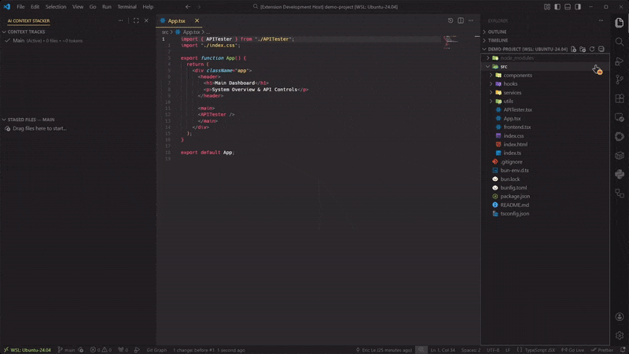

# AI Context Stacker

**Stop context switching. Stage your prompts instantly.**

Build the perfect context for ChatGPT, Claude, or any LLM without leaving VS Code. Drag files, switch between tasks, and copy everything in one click.



## The Problem

Working with language models typically means:

1. Open a file, select all, copy
2. Switch to browser, paste
3. Go back to VS Code
4. Repeat for every file
5. Try to remember what you already copied

This workflow becomes inefficient when working with multiple files simultaneously.

## Quick Start

1. **Install the extension** from the VS Code Marketplace
2. **Open the AI Context Stacker view** in the Activity Bar (left sidebar)
3. **Right-click any file** → "Add to AI Context Stack"
4. **Click the Copy Stack button** (📋 icon in the view title)
5. **Paste into your language model** – you're done

## Key Features

### Instant Context Staging

Stop copying files one by one. Drag files, folders, or use the right-click menu to build your context in seconds.

### Visual Token Heatmap

Instantly spot which files are consuming your context window.

- **Amber Icon**: File is "Heavy" (exceeds your configured threshold).
- **Red Icon**: File is "Critical" (exceeds 2x threshold).
- **Pinned Files**: Retain their pin icon but adopt the warning color.

### Seamless Navigation

Jump between your code and your context stack effortlessly.

- **Reveal in Stack**: Right-click any file in the VS Code Explorer to instantly find and focus it in the Staged Files view.
- **Reveal in Explorer**: Right-click any staged file to locate it in your system's file manager.

### Advanced Context Tracks

Organize your work into separate "tracks" (e.g., "Refactor Auth", "Bug Fix #123").

- **Custom Order**: Drag and drop tracks to reorder them exactly how you work.
- **Persistent**: Your tracks and file lists are saved automatically.
- **Reset**: Easily wipe all tracks to start fresh with a clean workspace.

### Smart Filtering & Pinning

- **Pin Important Files**: Keep critical docs or configs safe from the "Clear Stack" command.
- **Show Pinned Only**: Toggle the view to focus purely on your pinned context. "Copy Stack" respects this filter!

### Visual Context Map

Include an ASCII directory tree so the model understands your project structure at a glance.

```
Context Map
├── components
│   ├── Header.tsx
│   ├── Sidebar.tsx
│   └── Footer.tsx
├── utils
│   ├── api.ts
│   └── helpers.ts
└── README.md
```

## Installation

1. Open VS Code
2. Open Extensions (`Ctrl+Shift+X` or `Cmd+Shift+X`)
3. Search "AI Context Stacker"
4. Click Install

## Settings

| Setting                               | Type      | Default | Description                                                                                               |
| :------------------------------------ | :-------- | :------ | :-------------------------------------------------------------------------------------------------------- |
| `aiContextStacker.excludes`           | `array`   | `[]`    | Glob patterns for files to skip (e.g., `["**/node_modules/**"]`)                                          |
| `aiContextStacker.includeFileTree`    | `boolean` | `true`  | Include ASCII tree in copied output                                                                       |
| `aiContextStacker.largeFileThreshold` | `integer` | `5000`  | Token count at which a file is flagged as 'Heavy' (Amber). At 2x this value, it becomes 'Critical' (Red). |

Example configuration:

```json
{
  "aiContextStacker.excludes": ["**/node_modules/**", "**/.git/**", "**/dist/**"],
  "aiContextStacker.includeFileTree": true,
  "aiContextStacker.largeFileThreshold": 4000
}
```

## Commands

### Stack Operations

| Command              | Description                           |
| -------------------- | ------------------------------------- |
| `Add Files`          | Pick files to add to the stack        |
| `Remove Files...`    | Bulk uncheck files to remove them     |
| `Add All Open Files` | Stage everything currently open       |
| `Add Current File`   | Stage the active file                 |
| `Reveal in AI Stack` | Locate the active file in the stack   |
| `Clear Stack`        | Remove all files (except pinned ones) |
| `Toggle Pin`         | Pin or unpin a file                   |

### Output & Clipboard

| Command                  | Description                                                   |
| ------------------------ | ------------------------------------------------------------- |
| `Copy Stack`             | Copy all staged content to clipboard (respects active filter) |
| `Copy Context Map Only`  | Copy just the ASCII tree                                      |
| `Copy File Content Only` | Copy files without the tree                                   |
| `Preview Context`        | Open a webview showing exactly what will be copied            |

### View & Filtering

| Command                  | Description                                               |
| ------------------------ | --------------------------------------------------------- |
| `Reveal in Explorer`     | Open selected staged file in system file manager          |
| `Collapse All`           | Instantly collapse all folders (auto-hides if no folders) |
| `Show Pinned Files Only` | Filter the view to only pinned files                      |
| `Show All Files`         | Reset the view to show all staged files                   |
| `Manage Excludes`        | Configure exclusion patterns                              |
| `Configure Output`       | Toggle output options                                     |

### Track Management

| Command             | Description                            |
| ------------------- | -------------------------------------- |
| `New Track`         | Start a new context stack              |
| `Switch Track`      | Change to a different track            |
| `Rename Track`      | Rename the current track               |
| `Delete Track`      | Remove a track                         |
| `Delete All Tracks` | Reset workspace (delete all tracks)    |
| `Move Up / Down`    | Reorder tracks manually (context menu) |

## Tips

**Heatmap Optimization**: Adjust `aiContextStacker.largeFileThreshold` based on the model you are using (e.g., lower it for models with smaller context windows).

**Filtered Copying**: If you only want to copy your pinned documentation for a specific query, toggle "Show Pinned Only" before hitting Copy. The extension copies exactly what you see.

**Status Bar**: Click the status bar item (bottom right) to quickly copy your entire stack without opening the sidebar.

## Known Limitations

- Binary files are skipped automatically and marked with a warning icon
- Files over 1MB are excluded from token counting for performance reasons
- Token estimates are approximate (based on character count heuristics, not actual tokenizer output)
- The extension respects VS Code's file scheme restrictions (works with local files and most remote schemes)

## Support

- **Issues**: [GitHub Issues](https://github.com/erclx/ai-context-stacker/issues)
- **Changelog**: [CHANGELOG.md](CHANGELOG.md)

## License

MIT © 2025

Made with ☕ for developers who are tired of context switching.
